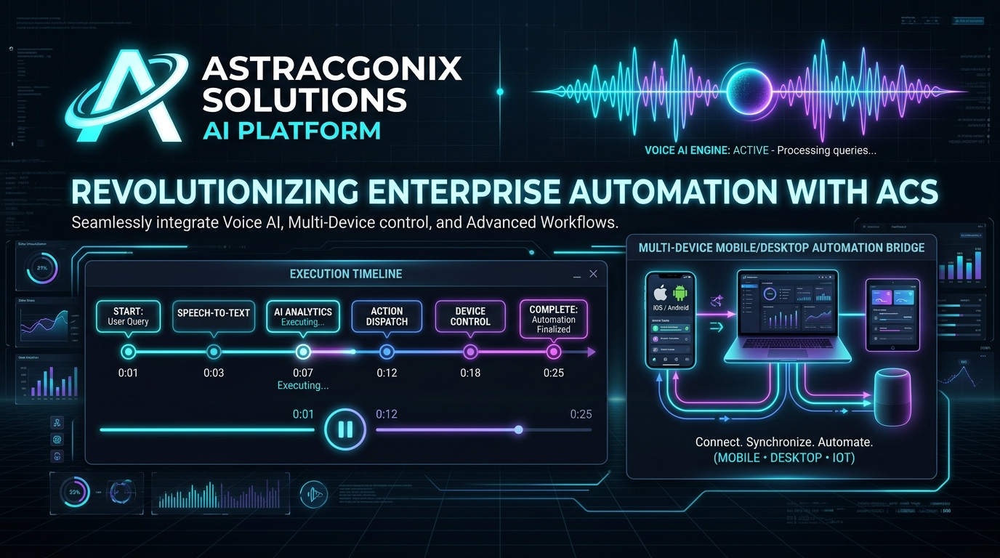
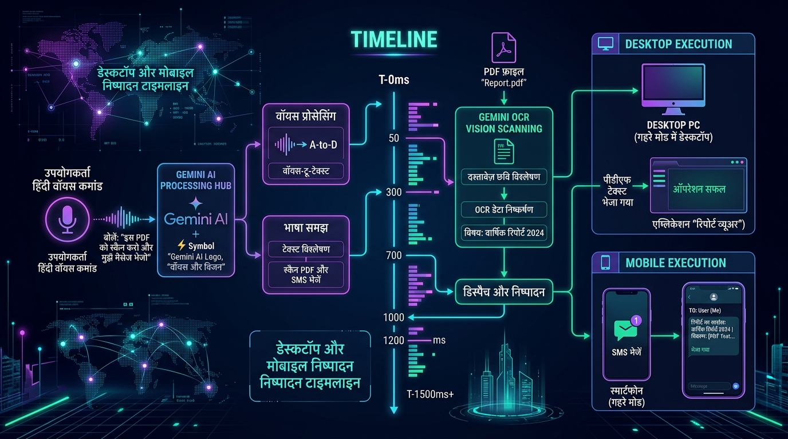

# 🚀 AstraCognix Solutions Pvt. Ltd. Automation AI
### Next-Generation Real-Time Voice AI & Multi-Device Desktop/Mobile Automation Engine



---

## 🌟 Executive Overview

**AstraCognix Solutions Pvt. Ltd.** is an enterprise-grade, autonomous **AI Voice Assistant & Multi-Device Automation System**. It combines low-latency real-time voice processing, multi-lingual natural language understanding (English, Hindi, Spanish, German, Japanese, Mandarin), Gemini Vision OCR, and direct OS-level application and mobile device execution.

Whether you are managing complex corporate PDF workflows, controlling desktop software like QuickBooks or Excel, dispatching SMS/WhatsApp notifications via connected Android hardware, or operating an AI Voice Call Center, **AstraCognix** provides an end-to-end command cockpit.

---

## 💎 Key Platform Features

### 1. 🎙️ Real-Time Voice Engine & Multi-Lingual Automation
* **Speech Recognition & NLU**: Real-time voice intent processing with adaptive noise reduction.
* **Multi-Lingual Capabilities**: Support for English, Hindi (hi-IN), Spanish, German, French, Japanese, and Mandarin.
* **Continuous Hands-Free Wake Word**: Active wake-word listening ("Hey Astra") with real-time waveform visualization.
* **Voice Personas**: Custom ElevenLabs & Gemini TTS voices tailored for executive, support, and technical roles.

### 2. ⚡ Live Interactive Execution Timeline
* **Step-by-Step Visual Progress**: Watch multi-step workflows execute in real time with animated nodes, status rings, and pulse indicators.
* **Playback Controls**: Adjust speed multipliers (1x, 2x, 5x), pause/resume execution, or reset timelines to pending state.
* **Live Telemetry & Terminal Logs**: Expand individual steps to inspect active device API drivers, execution protocols, and real-time JSON stream logs.
* **Dynamic Step Management**: Add custom workflow steps on the fly, edit parameters, or copy debug logs with one click.



---

### 3. 🖥️ Desktop & Mobile Hardware Bridge
* **Desktop Application Automation**: Directly launch, control, and extract data from local software (QuickBooks, Chrome, Excel, Mail clients).
* **Android Hardware Bridge**: Encrypted Wi-Fi/Bluetooth sync with mobile devices (e.g. Galaxy S24 Ultra) for phone calls, SMS messaging, and WhatsApp reminders.
* **File & Folder Manager**: Scan local directories, organize downloads by extension, and execute batch file processing rules.

### 4. 📑 Gemini Vision OCR & Document Intelligence
* **OCR PDF Scanning**: Extract text, headers, and complex financial tables from PDF reports.
* **Automated Summarizer**: Convert multi-page corporate documents into concise 3-bullet executive email digests.
* **User Confirmation Safety Gate**: Automated safety checks requiring user confirmation prior to sending emails or altering critical files.

---

### 5. 📞 Autonomous AI Voice Call Center & CRM
* **Real-Time Voice Calls**: Inbound and outbound AI voice handling with transcript logging and sentiment analytics.
* **CRM Lead Pipeline**: Automatic lead status updates, lead scoring, and appointment scheduling.
* **Custom Agent Personas**: Switch between specialized voice agent profiles (Executive, Support, Sales, Technical).

---

## 🛠️ System Architecture & Workflow Matrix

```
                          ┌──────────────────────────────────────────┐
                          │     AstraCognix Voice Input Engine       │
                          │      (Real-Time Voice Recognition)       │
                          └────────────────────┬─────────────────────┘
                                               │
                                               ▼
                          ┌──────────────────────────────────────────┐
                          │   Astra AI Intent & NLU Parsing Core    │
                          │   (Confidence Score & Context Engine)    │
                          └────────────────────┬─────────────────────┘
                                               │
                                               ▼
                          ┌──────────────────────────────────────────┐
                          │     Live Interactive Execution Timeline  │
                          │     (Step-by-Step Telemetry & Logs)      │
                          └──────┬──────────────────┬──────────┬─────┘
                                 │                  │          │
           ┌─────────────────────┘                  │          └─────────────────────┐
           ▼                                        ▼                                ▼
┌───────────────────────┐              ┌───────────────────────┐          ┌───────────────────────┐
│   Desktop OS Bridge   │              │   Cloud AI & OCR      │          │   Android Hardware    │
│  (Apps, Files, Web)   │              │   (Gemini Vision)     │          │  (Calls, SMS, Alarm)  │
└───────────────────────┘              └───────────────────────┘          └───────────────────────┘
```

---

## 🗣️ Sample Voice Commands

| Category | Voice Command Example | Execution Action |
| :--- | :--- | :--- |
| **Music & Audio** | *"play Believer by Imagine Dragons"* / *"play Kesariya"* | Retrieves track & plays automatically **within system player** (No YouTube redirect). |
| **OCR & PDF** | *"Summarize Q2_Report.pdf on my desktop and email to Marcus"* | Locates PDF, runs Gemini Vision OCR, generates summary, drafts email. |
| **Mobile Sync** | *"Check my Galaxy S24 unread SMS & read Marcus message"* | Connects via Android bridge, fetches unread SMS, reads aloud. |
| **Desktop Apps** | *"Open QuickBooks and scan recent invoices for totals"* | Launches QuickBooks UI, scans invoice totals, displays summary. |
| **Web & Search** | *"Search Google for latest AI automation trends and summarize"* | Opens browser tab, runs search query, highlights top findings. |
| **System Control**| *"Set system brightness to 60% and volume to 80%"* | Dispatches OS setting parameters instantly. |

---

## 🛡️ Enterprise Security & Data Governance

* **Encrypted Hardware Bridge**: Local AES-256 encrypted communication between desktop and mobile endpoints.
* **Strict Permission Gates**: User confirmation required for sensitive actions (email dispatch, file deletions, payment processing).
* **Privacy Controls**: Zero telemetry retention for voice stream recordings.

---

## 📝 Credits & Creator Information

**Created by Niket Raj**  
**Company: AstraCognix Solutions Pvt. Ltd.**

---
*© 2026 AstraCognix Solutions Pvt. Ltd. All rights reserved.*
